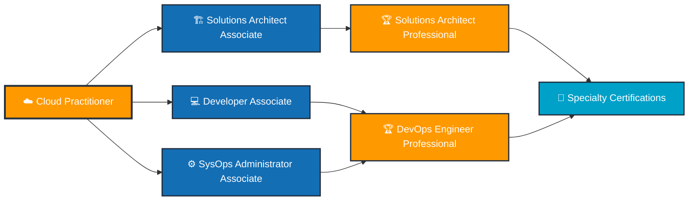

# ☁️ AWS Cloud Practitioner Certification

<div align="center">


**AWS Cloud Practitioner Specialization - Foundational Cloud Computing Excellence**

[](./AWS%20Cloud%20Practitioner%20Certification.pdf)
[](https://coursera.org/verify/specialization/VBSFZP165Q8S)

</div>

---

## 🏆 Certification Overview

| Category | Details |
|----------|---------|
| **🎯 Certification** | AWS Cloud Practitioner Specialization |
| **🏢 Provider** | Amazon Web Services (AWS) |
| **📚 Platform** | Coursera by LearnKartS |
| **📅 Issue Date** | October 19, 2025 |
| **🆔 Credential ID** | `VBSFZP165Q8S` |
| **✅ Status** | **ACTIVE & VERIFIED** |
| **📊 Courses Completed** | 4 Comprehensive Courses |

---

## 📚 Specialization Curriculum

### Course 1: ☁️ Cloud Fundamentals
**Core cloud computing concepts and principles**
- Cloud computing models (IaaS, PaaS, SaaS)
- Cloud deployment types (Public, Private, Hybrid)
- Benefits and advantages of cloud computing
- Cloud service models and use cases

### Course 2: 🚀 Introduction to AWS
**AWS ecosystem, history, and foundational services**
- AWS global infrastructure and regions
- Core AWS services overview
- AWS account management
- AWS Well-Architected Framework fundamentals

### Course 3: 🛠️ AWS Services
**Deep dive into compute, storage, and database offerings**
- **Compute**: EC2, Lambda, Elastic Beanstalk
- **Storage**: S3, EBS, EFS, Glacier
- **Database**: RDS, DynamoDB, Aurora, Redshift
- **Networking**: VPC, CloudFront, Route 53
- **Security**: IAM, Security Groups, KMS

### Course 4: 💰 AWS Pricing
**Cost management and optimization strategies**
- AWS pricing models and structure
- Cost optimization best practices
- AWS pricing calculator and tools
- Total Cost of Ownership (TCO) analysis
- AWS billing and cost management

---

## 💡 Skills & Competencies Validated

<div align="center">

### Technical Proficiency

</div>

#### ☁️ Cloud Architecture
- Understanding of AWS global infrastructure
- Knowledge of Availability Zones and Regions
- AWS Well-Architected Framework principles
- High availability and fault tolerance concepts

#### 🔧 AWS Services Mastery
- **Compute**: EC2 instances, Lambda serverless functions
- **Storage**: S3 object storage, EBS block storage
- **Database**: Relational (RDS) and NoSQL (DynamoDB)
- **Networking**: VPC configuration, load balancing
- **Security**: IAM policies, encryption, compliance

#### 💰 Business & Financial Acumen
- Cloud economics and value proposition
- AWS pricing models (On-Demand, Reserved, Spot)
- Cost optimization strategies
- AWS Free Tier understanding
- Billing and cost management tools

#### 🔒 Security & Compliance
- Shared Responsibility Model
- IAM best practices
- Data encryption and key management
- Compliance programs (HIPAA, PCI-DSS, GDPR)

---

## 🎯 Why This Certification Matters

### Industry Recognition
> *"AWS holds approximately 32% of the cloud market share, making AWS skills among the most valuable in the tech industry."*

### Career Impact
- ✅ **Foundation for Advanced AWS Certifications** - Gateway to Solutions Architect, Developer, SysOps paths
- ✅ **Industry-Standard Knowledge** - Recognized globally by employers
- ✅ **Cloud-First Mindset** - Essential for modern IT infrastructure
- ✅ **High Demand Skills** - Cloud roles consistently rank in top-paying tech positions

### Real-World Applications
- Migrate on-premises infrastructure to AWS
- Design cost-effective cloud solutions
- Implement secure and compliant architectures
- Optimize cloud spending and resource utilization

---

## 🔗 Verification & Credentials

### Quick Verification
```bash
🔍 Verify Certificate: https://coursera.org/verify/specialization/VBSFZP165Q8S
📧 Credential ID: VBSFZP165Q8S
👤 Recipient: Michael Martinez Chaves
📅 Issued: October 19, 2025
```

### Certificate Files
- 📄 **PDF Certificate**: [AWS Cloud Practitioner Certification.pdf](./AWS%20Cloud%20Practitioner%20Certification.pdf)
- 🖼️ **Badge Image**: [AWS Cloud Practitioner Certification.png](./AWS%20Cloud%20Practitioner%20Certification.png)

---

## 🚀 Next Steps in AWS Journey

### Recommended AWS Certification Path



### Immediate Next Steps
1. **🏗️ AWS Solutions Architect Associate** - Design and deploy scalable systems
2. **💻 AWS Developer Associate** - Develop and maintain AWS applications
3. **⚙️ AWS SysOps Administrator Associate** - Deploy, manage, and operate AWS systems

### Advanced Specializations
- **🌐 AWS Advanced Networking** - Specialty
- **🔒 AWS Security** - Specialty
- **📊 AWS Data Analytics** - Specialty
- **🤖 AWS Machine Learning** - Specialty

---

## 📖 Learning Resources & References

### Official AWS Resources
- [AWS Documentation](https://docs.aws.amazon.com/)
- [AWS Training and Certification](https://aws.amazon.com/training/)
- [AWS Free Tier](https://aws.amazon.com/free/)
- [AWS Well-Architected Framework](https://aws.amazon.com/architecture/well-architected/)

### Hands-On Practice
- [AWS Free Tier Account](https://aws.amazon.com/free/)
- [AWS Skill Builder](https://skillbuilder.aws/)
- [AWS Workshops](https://workshops.aws/)
- [AWS Architecture Center](https://aws.amazon.com/architecture/)

### Community & Support
- [AWS Community Forums](https://forums.aws.amazon.com/)
- [AWS re:Post](https://repost.aws/)
- [r/aws](https://www.reddit.com/r/aws/) - Reddit Community
- [AWS User Groups](https://aws.amazon.com/developer/community/usergroups/)

---

## 📊 Certification Statistics

### By The Numbers
- **📚 Total Courses**: 4 comprehensive courses
- **⏱️ Study Duration**: ~40-60 hours of content
- **🎯 Passing Standard**: Successfully completed all assessments
- **🌍 Global Recognition**: Valid worldwide
- **📈 Career Impact**: Avg. 15-20% salary increase for cloud-certified professionals

### Skills Distribution
```
Cloud Fundamentals    ████████████████████ 100%
AWS Services          ████████████████████ 100%
Cost Optimization     ████████████████████ 100%
Security & Compliance ████████████████████ 100%
Architecture Design   ████████████████████ 100%
```

---

## 🎓 About the Credential Holder

**Michael Martinez Chaves**
- 💼 Pursuing Cloud Architecture Excellence
- 🎯 AWS Cloud Practitioner Certified
- 🚀 Building expertise in Linux, DevOps, and Cloud Infrastructure
- 🔗 [GitHub: MikeDMart](https://github.com/MikeDMart)

---

## 📞 Connect & Collaborate

Interested in cloud architecture, AWS solutions, or collaboration opportunities?

- 💼 **LinkedIn**: [Connect with me](https://linkedin.com/in/your-profile)
- 🐙 **GitHub**: [@MikeDMart](https://github.com/MikeDMart)
- 📧 **Email**: [your.email@example.com](mailto:your.email@example.com)

---

<div align="center">

### 🏅 Certification Achieved

**AWS Cloud Practitioner Specialization**

*Preparing for cloud dominance, one certification at a time* ☁️🚀

---


**Earned October 2025** | **Credential ID: VBSFZP165Q8S**

*"The cloud is not just the future – it's the present. This certification is my commitment to cloud excellence."*

</div>
