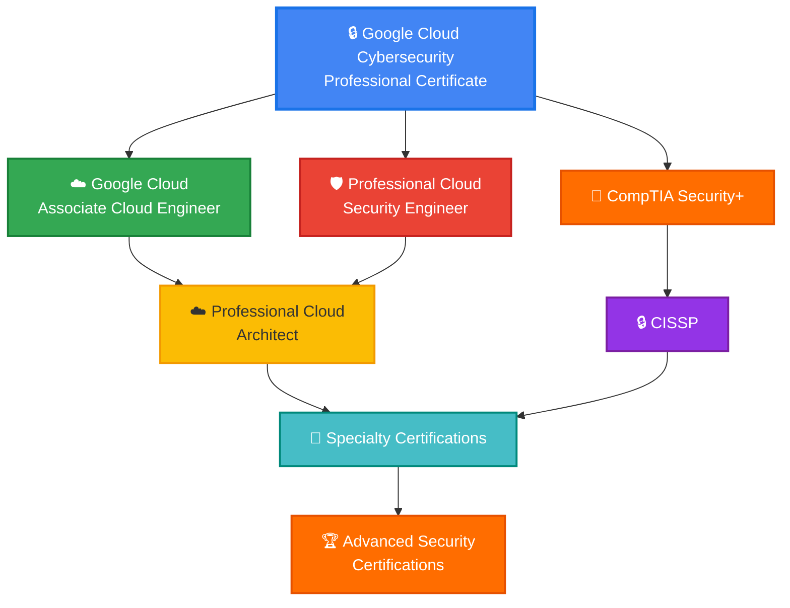

# 🔒 Google Cloud Cybersecurity Professional Certificate

<div align="center">


**Google Cloud Cybersecurity Professional Certificate - Defending Cloud Infrastructure**

[](./Google%20Cloud%20Cybersecurity%20Professional%20Certificate.pdf)
[](https://coursera.org/verify/professional-cert/VYHXZ6F2L3JH)
[](https://www.credly.com/)

</div>

---

## 🏆 Certification Overview

| Category | Details |
|----------|---------|
| **🎯 Certification** | Google Cloud Cybersecurity Professional Certificate |
| **🏢 Provider** | Google Cloud |
| **📚 Platform** | Coursera |
| **📅 Issue Date** | October 18, 2025 |
| **🆔 Credential ID** | `VYHXZ6F2L3JH` |
| **✅ Status** | **ACTIVE & VERIFIED** |
| **📊 Courses Completed** | 5 Comprehensive Courses |
| **🎓 ACE® Credits** | Up to 9 college credits recommended |
| **🏅 Digital Badge** | Available on Credly |

---

## 📚 Professional Certificate Curriculum

### Course 1: 🛡️ Introduction to Security Principles in Cloud Computing
**Foundation of cloud security concepts and frameworks**
- Cloud security fundamentals and CIA triad
- Shared responsibility model in cloud environments
- Cloud security architecture principles
- Compliance and regulatory frameworks (GDPR, HIPAA, SOC 2)
- Identity and Access Management (IAM) basics

### Course 2: 📋 Strategies for Cloud Security Risk Management
**Comprehensive risk assessment and mitigation strategies**
- Cloud risk assessment methodologies
- Threat modeling and analysis
- Security control frameworks (NIST, CIS Controls)
- Risk mitigation and treatment strategies
- Security policy development and implementation
- Business continuity and disaster recovery planning

### Course 3: 🔍 Cloud Security Risks: Identify and Protect Against Threats
**Proactive threat identification and protection mechanisms**
- Common cloud security threats and vulnerabilities
- Data protection and encryption strategies
- Network security in cloud environments
- Container and Kubernetes security
- API security best practices
- Zero Trust security model implementation
- Security monitoring and logging

### Course 4: 🚨 Detect, Respond, and Recover from Cloud Cybersecurity Attacks
**Incident response and recovery procedures**
- Security Information and Event Management (SIEM)
- Threat detection and analysis
- Incident response frameworks (NIST, SANS)
- Digital forensics in cloud environments
- Recovery and remediation strategies
- Post-incident analysis and lessons learned
- Automated response and orchestration

### Course 5: 💼 Put It All Together: Prepare for a Cloud Security Analyst Job
**Career preparation and real-world application**
- Cloud security analyst role and responsibilities
- Job search strategies and resume building
- Technical interview preparation
- Hands-on capstone project
- Professional portfolio development
- Industry best practices and career pathways

---

## 💡 Skills & Competencies Validated

<div align="center">

### 🎯 Core Security Competencies

</div>

#### 🔒 Cloud Security Fundamentals
- **Shared Responsibility Model** understanding
- **Zero Trust Architecture** principles
- **Defense in Depth** strategies
- **Least Privilege Access** implementation
- **Security by Design** methodology

#### 🛡️ Threat Management
- **Threat Intelligence** analysis and application
- **Vulnerability Assessment** and management
- **Penetration Testing** methodologies
- **Security Monitoring** and alerting
- **Incident Response** procedures

#### ☁️ Google Cloud Platform Security
- **Cloud IAM** configuration and best practices
- **VPC Security** and network segmentation
- **Cloud Armor** for DDoS protection
- **Security Command Center** operations
- **Cloud KMS** for encryption key management
- **Cloud Logging & Monitoring** implementation

#### 🔍 Detection & Response
- **SIEM** configuration and management
- **Log Analysis** and correlation
- **Threat Hunting** techniques
- **Forensic Investigation** procedures
- **Automated Remediation** workflows

#### 📊 Risk & Compliance
- **Risk Assessment** frameworks (NIST CSF, ISO 27001)
- **Compliance Auditing** (PCI-DSS, HIPAA, GDPR)
- **Security Metrics** and KPIs
- **Policy Development** and governance
- **Security Awareness Training** programs

---

## 🎯 Why This Certification Matters

### Industry Demand
> *"Cloud security roles are projected to grow 31% by 2029, with median salaries exceeding $120,000 USD annually."*

### Career Impact
- ✅ **High-Growth Field** - Cloud cybersecurity is one of the fastest-growing tech sectors
- ✅ **Industry Recognition** - Backed by Google Cloud, a top 3 cloud provider
- ✅ **Hands-On Training** - Real-world scenarios and practical skills
- ✅ **Job-Ready Skills** - Prepared for cloud security analyst and specialist roles
- ✅ **Academic Credit** - ACE® recommends up to 9 college credits

### Role Preparation
This certificate prepares you for roles including:
- 🎯 **Cloud Security Analyst**
- 🎯 **Cybersecurity Specialist**
- 🎯 **Cloud Security Engineer**
- 🎯 **Security Operations Center (SOC) Analyst**
- 🎯 **Cloud Compliance Analyst**
- 🎯 **Incident Response Specialist**

---

## 🔗 Verification & Credentials

### Quick Verification
```bash
🔍 Verify Certificate: https://coursera.org/verify/professional-cert/VYHXZ6F2L3JH
📧 Credential ID: VYHXZ6F2L3JH
👤 Recipient: Michael Martinez Chaves
📅 Issued: October 18, 2025
🏅 Digital Badge: Available on Credly
```

### Official Links
- 📄 **Certificate PDF**: [Google Cloud Cybersecurity Professional Certificate.pdf](./Google%20Cloud%20Cybersecurity%20Professional%20Certificate.pdf)
- 🖼️ **Badge Image**: [Google Cloud Cybersecurity Professional Certificate.png](./Google%20Cloud%20Cybersecurity%20Professional%20Certificate.png)
- 🔗 **Online Verification**: [Coursera Verification](https://coursera.org/verify/professional-cert/VYHXZ6F2L3JH)
- 🏅 **Digital Badge**: [Claim on Credly](https://www.credly.com/)

### Academic Recognition
- 🎓 **ACE® Credit Recommendation**: Up to 9 college credits
- 📚 **Note**: Credit acceptance is determined by individual institutions

---

## 🚀 Career Pathways & Next Steps

### Recommended Certification Progression



### Immediate Next Steps

#### Google Cloud Certifications
1. **☁️ Associate Cloud Engineer** - Cloud infrastructure management
2. **🛡️ Professional Cloud Security Engineer** - Advanced GCP security
3. **📊 Professional Cloud Architect** - Cloud solution design

#### Industry-Standard Certifications
1. **🔐 CompTIA Security+** - Foundational cybersecurity
2. **🔒 CISSP** - Information security professional
3. **🛡️ CISM** - Information security management
4. **☁️ CCSP** - Cloud security professional

#### Specialized Paths
- **🔍 CEH (Certified Ethical Hacker)** - Penetration testing
- **🚨 GCIH (GIAC Certified Incident Handler)** - Incident response
- **📋 CISA** - Information systems auditing
- **☁️ AWS/Azure Security Specialties** - Multi-cloud expertise

---

## 🛠️ Tools & Technologies Mastered

### Google Cloud Security Tools
| Tool | Purpose | Proficiency |
|------|---------|-------------|
| **Cloud IAM** | Identity & Access Management | ⭐⭐⭐⭐⭐ |
| **VPC Service Controls** | Network security perimeter | ⭐⭐⭐⭐⭐ |
| **Security Command Center** | Centralized security management | ⭐⭐⭐⭐⭐ |
| **Cloud Armor** | DDoS protection & WAF | ⭐⭐⭐⭐ |
| **Cloud KMS** | Encryption key management | ⭐⭐⭐⭐⭐ |
| **Cloud Logging** | Log management & analysis | ⭐⭐⭐⭐⭐ |
| **Cloud Monitoring** | Infrastructure monitoring | ⭐⭐⭐⭐ |
| **Binary Authorization** | Container deployment security | ⭐⭐⭐⭐ |

### Security Frameworks & Standards
- **NIST Cybersecurity Framework (CSF)**
- **ISO/IEC 27001** - Information Security Management
- **CIS Controls** - Center for Internet Security
- **OWASP Top 10** - Web application security
- **MITRE ATT&CK** - Threat modeling framework

---

## 📊 Certification Statistics

### By The Numbers
- **📚 Total Courses**: 5 comprehensive courses
- **⏱️ Program Duration**: ~150-200 hours of content
- **🎯 Hands-On Projects**: Multiple real-world scenarios
- **🌍 Global Recognition**: Industry-recognized credential
- **💰 Career Impact**: Avg. 20-30% salary increase for cloud security roles
- **🎓 Academic Value**: 9 ACE® college credits recommended

### Skills Mastery Distribution
```
Cloud Security Fundamentals    ████████████████████ 100%
Threat Detection & Response    ████████████████████ 100%
Risk Management               ████████████████████ 100%
Incident Response             ████████████████████ 100%
GCP Security Tools            ████████████████████ 100%
Compliance & Governance       ████████████████████ 100%
```

---

## 🎓 Real-World Applications

### Practical Skills Acquired

#### 1. 🔒 Secure Cloud Infrastructure Design
- Design multi-tier secure architectures on GCP
- Implement network segmentation and micro-segmentation
- Configure secure API gateways and endpoints
- Deploy secure containerized applications

#### 2. 🚨 Threat Detection & Incident Response
- Monitor and analyze security events in real-time
- Investigate and respond to security incidents
- Conduct root cause analysis and forensics
- Implement automated threat response workflows

#### 3. 📋 Compliance & Risk Management
- Conduct security assessments and audits
- Develop and maintain security policies
- Implement compliance controls (PCI-DSS, HIPAA, GDPR)
- Create risk registers and mitigation plans

#### 4. 🛡️ Security Operations
- Configure SIEM for cloud environments
- Deploy and manage security monitoring tools
- Perform vulnerability assessments
- Execute penetration testing procedures

---

## 📖 Learning Resources & References

### Google Cloud Security Resources
- [Google Cloud Security Best Practices](https://cloud.google.com/security/best-practices)
- [Google Cloud Security Documentation](https://cloud.google.com/security)
- [Google Cloud Security Command Center](https://cloud.google.com/security-command-center)
- [Google Cloud Compliance](https://cloud.google.com/security/compliance)

### Security Frameworks
- [NIST Cybersecurity Framework](https://www.nist.gov/cyberframework)
- [CIS Controls](https://www.cisecurity.org/controls)
- [OWASP Top 10](https://owasp.org/www-project-top-ten/)
- [MITRE ATT&CK Framework](https://attack.mitre.org/)

### Hands-On Practice
- [Google Cloud Skills Boost](https://www.cloudskillsboost.google/)
- [Google Cloud Free Tier](https://cloud.google.com/free)
- [Qwiklabs](https://www.qwiklabs.com/)
- [Google Cloud Architecture Center](https://cloud.google.com/architecture)

### Community & Support
- [Google Cloud Community](https://www.googlecloudcommunity.com/)
- [r/googlecloud](https://www.reddit.com/r/googlecloud/)
- [Google Cloud Security Slack](https://googlecloud-community.slack.com/)
- [Cloud Security Alliance (CSA)](https://cloudsecurityalliance.org/)

---

## 💼 Career Opportunities

### Job Roles Prepared For

#### Entry to Mid-Level Positions
| Role | Avg. Salary (USD) | Description |
|------|-------------------|-------------|
| **Cloud Security Analyst** | $75,000 - $110,000 | Monitor and respond to security threats |
| **Cybersecurity Specialist** | $70,000 - $105,000 | Implement security controls and policies |
| **SOC Analyst** | $65,000 - $95,000 | Security operations center monitoring |
| **Cloud Compliance Analyst** | $70,000 - $100,000 | Ensure regulatory compliance |

#### Advanced Positions (With Experience)
| Role | Avg. Salary (USD) | Description |
|------|-------------------|-------------|
| **Cloud Security Engineer** | $110,000 - $160,000 | Design and implement security solutions |
| **Security Architect** | $130,000 - $180,000 | Enterprise security architecture design |
| **Incident Response Manager** | $120,000 - $165,000 | Lead incident response teams |
| **CISO (Chief Information Security Officer)** | $180,000 - $300,000+ | Executive security leadership |

---

## 🎓 About the Credential Holder

**Michael Martinez Chaves**
- 🔒 Google Cloud Cybersecurity Professional
- ☁️ AWS Cloud Practitioner Certified
- 🐧 Linux System Administration & DevOps Specialist
- 🎯 Pursuing Cloud Security Engineering Excellence
- 🔗 [GitHub: MikeDMart](https://github.com/MikeDMart)

### Professional Focus Areas
- ☁️ Cloud Security Architecture (GCP, AWS, Azure)
- 🔒 Zero Trust Security Implementation
- 🚨 Incident Response & Threat Hunting
- 📋 Security Compliance & Risk Management
- 🐧 Linux Security Hardening

---

## 📞 Connect & Collaborate

Interested in cloud security, threat detection, or security architecture collaboration?

- 💼 **LinkedIn**: [Connect with me](https://linkedin.com/in/your-profile)
- 🐙 **GitHub**: [@MikeDMart](https://github.com/MikeDMart)
- 📧 **Email**: [your.email@example.com](mailto:your.email@example.com)
- 🏅 **Credly**: [View Digital Badges](https://www.credly.com/users/your-profile)

---

<div align="center">

### 🏅 Professional Certificate Achieved

**Google Cloud Cybersecurity Professional Certificate**

*Defending cloud infrastructure, one threat at a time* 🔒☁️

---


**Earned October 2025** | **Credential ID: VYHXZ6F2L3JH**

*"In cybersecurity, the mission never stops. This certification represents my commitment to protecting cloud infrastructure and data against evolving threats."*

</div>
