# 💻 IBM Cloud Application Development Foundations Specialization

<div align="center">


**IBM Cloud Application Development Foundations - Full-Stack Cloud Developer**

[](./IBM%20Cloud%20Application%20Development%20Foundations%20Specialization.pdf)
[](https://coursera.org/verify/specialization/0U19TC38PRYF)

</div>

---

## 🏆 Specialization Overview

| Category | Details |
|----------|---------|
| **🎯 Specialization** | Cloud Application Development Foundations |
| **🏢 Provider** | IBM (International Business Machines) |
| **📚 Platform** | Coursera |
| **📅 Issue Date** | October 22, 2025 |
| **🆔 Credential ID** | `0U19TC38PRYF` |
| **✅ Status** | **ACTIVE & VERIFIED** |
| **📊 Courses Completed** | 5 Comprehensive Courses |
| **💼 Career Focus** | Full-Stack Cloud Application Developer |
| **🛠️ Tech Stack** | MERN & MEVN Stacks |

---

## 📚 Specialization Curriculum

### Course 1: ☁️ Introduction to Cloud Computing
**Foundation of cloud computing and modern infrastructure**
- Cloud computing fundamentals and service models
- IaaS, PaaS, and SaaS architectures
- Public, Private, and Hybrid cloud deployments
- Cloud adoption and migration strategies
- Major cloud providers (IBM Cloud, AWS, Azure, GCP)
- Cloud security and compliance basics
- Cost optimization strategies

### Course 2: 🌐 Introduction to Web Development with HTML, CSS, JavaScript
**Front-end development essentials**
- **HTML5**: Semantic markup, forms, and multimedia
- **CSS3**: Layouts, flexbox, grid, responsive design
- **JavaScript**: ES6+ features, DOM manipulation, events
- Browser DevTools and debugging
- Web accessibility (WCAG) standards
- Progressive Web Apps (PWA) basics
- Performance optimization techniques

### Course 3: 🚀 Get Started with Cloud Native, DevOps, Agile, and NoSQL
**Modern development methodologies and databases**
- **Cloud Native Architecture**: Microservices, containers, Kubernetes
- **DevOps**: CI/CD pipelines, automation, monitoring
- **Agile Methodology**: Scrum, sprints, user stories
- **NoSQL Databases**: MongoDB, document stores, data modeling
- **Containerization**: Docker fundamentals and best practices
- **Version Control**: Git workflows and collaboration
- **Infrastructure as Code**: Configuration management

### Course 4: 🔧 Developing Back-End Apps with Node.js and Express
**Server-side JavaScript development**
- **Node.js**: Asynchronous programming, event loop, modules
- **Express.js**: RESTful API design, routing, middleware
- **Database Integration**: MongoDB with Mongoose ODM
- **Authentication**: JWT, OAuth, session management
- **Error Handling**: Proper error responses and logging
- **API Testing**: Postman, automated testing
- **Deployment**: Heroku, IBM Cloud, containerization

### Course 5: ⚛️ Developing Front-End Apps with React
**Modern front-end development with React**
- **React Fundamentals**: Components, JSX, virtual DOM
- **Hooks**: useState, useEffect, useContext, custom hooks
- **State Management**: Context API, Redux patterns
- **Routing**: React Router, navigation, protected routes
- **API Integration**: Axios, fetch, async operations
- **Styling**: CSS Modules, Styled Components, Material-UI
- **Testing**: Jest, React Testing Library
- **Build & Deployment**: Create React App, optimization

---

## 💡 Technical Skills & Competencies

<div align="center">

### 🎯 Full-Stack Development Mastery

</div>

#### 🎨 Front-End Development
| Technology | Proficiency | Use Case |
|------------|-------------|----------|
| **HTML5** | ⭐⭐⭐⭐⭐ | Semantic markup, accessibility |
| **CSS3** | ⭐⭐⭐⭐⭐ | Responsive design, animations |
| **JavaScript (ES6+)** | ⭐⭐⭐⭐⭐ | Modern JS features, async/await |
| **React.js** | ⭐⭐⭐⭐⭐ | Component-based UI development |
| **Redux** | ⭐⭐⭐⭐ | State management for complex apps |

#### 🔧 Back-End Development
| Technology | Proficiency | Use Case |
|------------|-------------|----------|
| **Node.js** | ⭐⭐⭐⭐⭐ | Server-side JavaScript runtime |
| **Express.js** | ⭐⭐⭐⭐⭐ | RESTful API development |
| **MongoDB** | ⭐⭐⭐⭐⭐ | NoSQL database operations |
| **Mongoose** | ⭐⭐⭐⭐ | MongoDB ODM and data modeling |
| **JWT/OAuth** | ⭐⭐⭐⭐ | Authentication & authorization |

#### ☁️ Cloud & DevOps
| Technology | Proficiency | Use Case |
|------------|-------------|----------|
| **IBM Cloud** | ⭐⭐⭐⭐⭐ | Cloud application deployment |
| **Docker** | ⭐⭐⭐⭐ | Containerization |
| **Kubernetes** | ⭐⭐⭐⭐ | Container orchestration |
| **CI/CD** | ⭐⭐⭐⭐ | Continuous integration/deployment |
| **Git/GitHub** | ⭐⭐⭐⭐⭐ | Version control & collaboration |

#### 🏗️ Software Engineering
- **Agile/Scrum Methodology** - Sprint planning, user stories, retrospectives
- **RESTful API Design** - HTTP methods, status codes, best practices
- **Microservices Architecture** - Service decomposition, communication patterns
- **Test-Driven Development (TDD)** - Unit tests, integration tests
- **Cloud Native Patterns** - 12-factor app, scalability, resilience

---

## 🎯 Tech Stacks Mastered

### MERN Stack (MongoDB, Express, React, Node.js)
```javascript
// Full-Stack JavaScript Development
Frontend: React.js + Redux + React Router
Backend:  Node.js + Express.js + MongoDB
Tools:    npm/yarn, Webpack, Babel
Deploy:   Docker, Kubernetes, IBM Cloud
```

### MEVN Stack (MongoDB, Express, Vue.js, Node.js)
```javascript
// Alternative Full-Stack with Vue.js
Frontend: Vue.js + Vuex + Vue Router
Backend:  Node.js + Express.js + MongoDB
Tools:    npm/yarn, Webpack, Babel
Deploy:   Docker, Kubernetes, IBM Cloud
```

---

## 🚀 Real-World Projects & Applications

### Capstone Projects Completed

#### 1. 🛒 Full-Stack E-Commerce Platform
**MERN Stack Implementation**
- User authentication and authorization
- Product catalog with search and filters
- Shopping cart and checkout process
- Admin dashboard for inventory management
- RESTful API backend with Express
- Responsive React frontend
- MongoDB database integration

#### 2. 📱 Cloud-Native Social Media App
**Microservices Architecture**
- User profiles and authentication service
- Post creation and feed service
- Real-time notifications with WebSockets
- File upload and storage (IBM Cloud Object Storage)
- Containerized deployment with Docker
- CI/CD pipeline with GitHub Actions

#### 3. 📊 Data Visualization Dashboard
**React + Node.js + NoSQL**
- Interactive data visualizations with Chart.js
- Real-time data updates with WebSockets
- RESTful API for data aggregation
- MongoDB for flexible data storage
- Responsive design with Material-UI

---

## 💼 Career Preparation

### Job Roles Prepared For

#### Entry-Level Positions
| Role | Avg. Salary (USD) | Description |
|------|-------------------|-------------|
| **Junior Full-Stack Developer** | $60,000 - $85,000 | End-to-end web application development |
| **Front-End Developer** | $55,000 - $80,000 | React-based UI development |
| **Back-End Developer** | $60,000 - $85,000 | Node.js API development |
| **Cloud Application Developer** | $65,000 - $90,000 | Cloud-native application development |

#### Mid-Level Positions (With Experience)
| Role | Avg. Salary (USD) | Description |
|------|-------------------|-------------|
| **Full-Stack Developer** | $85,000 - $130,000 | Complete web application development |
| **Cloud Solutions Developer** | $90,000 - $140,000 | Cloud application architecture |
| **DevOps Engineer** | $95,000 - $145,000 | CI/CD and cloud infrastructure |
| **Software Engineer** | $90,000 - $150,000 | Enterprise application development |

#### Senior Positions (With Extensive Experience)
| Role | Avg. Salary (USD) | Description |
|------|-------------------|-------------|
| **Senior Full-Stack Engineer** | $130,000 - $180,000 | Technical leadership and architecture |
| **Cloud Architect** | $140,000 - $200,000 | Cloud solution design and strategy |
| **Engineering Manager** | $150,000 - $220,000 | Team leadership and delivery |

---

## 🎯 Why This Specialization Matters

### Industry Relevance
> *"Full-stack developers are among the most sought-after professionals in tech, with demand projected to grow 22% by 2030."*

### Career Impact
- ✅ **Complete Skill Set** - Front-end, back-end, cloud, and DevOps
- ✅ **Industry-Standard Stack** - MERN/MEVN used by Fortune 500 companies
- ✅ **IBM Backed** - Training from a tech industry leader
- ✅ **Cloud Ready** - Deploy applications to production environments
- ✅ **Job Market Advantage** - Full-stack developers command premium salaries

### Real-World Value
- Build and deploy complete web applications
- Work with modern JavaScript frameworks
- Implement cloud-native architectures
- Follow industry best practices and design patterns
- Collaborate effectively in Agile teams

---

## 🔗 Verification & Credentials

### Quick Verification
```bash
🔍 Verify Certificate: https://coursera.org/verify/specialization/0U19TC38PRYF
📧 Credential ID: 0U19TC38PRYF
👤 Recipient: Michael Martinez Chaves
📅 Issued: October 22, 2025
🏢 Issuer: IBM via Coursera
```

### Certificate Files
- 📄 **PDF Certificate**: [IBM Cloud Application Development Foundations Specialization.pdf](./IBM%20Cloud%20Application%20Development%20Foundations%20Specialization.pdf)
- 🖼️ **Badge Image**: [IBM Cloud Application Development Foundations Specialization.png](./IBM%20Cloud%20Application%20Development%20Foundations%20Specialization.png)

---

## 🚀 Next Steps & Advanced Learning

### Recommended IBM Certifications

```mermaid
graph TD
    A[💻 Cloud Application<br/>Development Foundations] --> B[🔷 IBM Full Stack<br/>Software Developer]
    A --> C[☁️ IBM Cloud<br/>Developer Professional]
    A --> D[🔧 IBM DevOps and<br/>Software Engineering]
    
    B --> E[🏆 IBM Professional<br/>Certifications]
    C --> E
    D --> E
    
    E --> F[🎯 Advanced<br/>Specializations]
    
    style A fill:#054ADA,stroke:#003d82,stroke-width:3px,color:#fff
    style B fill:#0062FF,stroke:#003d82,stroke-width:2px,color:#fff
    style C fill:#0062FF,stroke:#003d82,stroke-width:2px,color:#fff
    style D fill:#0062FF,stroke:#003d82,stroke-width:2px,color:#fff
    style E fill:#FF6B6B,stroke:#c92a2a,stroke-width:2px,color:#fff
    style F fill:#40C057,stroke:#2f9e44,stroke-width:2px,color:#fff
```



### Immediate Next Steps

#### IBM Certifications
1. **🔷 IBM Full Stack Software Developer Professional Certificate**
2. **☁️ IBM Cloud Developer Professional Certificate**
3. **🔧 IBM DevOps and Software Engineering Professional Certificate**
4. **📊 IBM Data Engineering Professional Certificate**

#### Complementary Certifications
1. **⚛️ Meta Front-End Developer Professional Certificate**
2. **🔧 Meta Back-End Developer Professional Certificate**
3. **☁️ AWS Certified Developer - Associate**
4. **🔷 Microsoft Certified: Azure Developer Associate**

#### Advanced Skills
- **TypeScript** for type-safe JavaScript
- **GraphQL** for modern API development
- **Microservices** architecture patterns
- **Serverless** computing (AWS Lambda, IBM Cloud Functions)
- **Kubernetes** advanced orchestration

---

## 📖 Learning Resources & References

### Official IBM Resources
- [IBM Cloud Documentation](https://cloud.ibm.com/docs)
- [IBM Developer](https://developer.ibm.com/)
- [IBM Cloud Skills](https://www.ibm.com/training/cloud)
- [IBM Cloud Architecture Center](https://www.ibm.com/cloud/architecture)

### Technology Documentation
- [Node.js Official Docs](https://nodejs.org/docs/)
- [React Official Docs](https://react.dev/)
- [Express.js Guide](https://expressjs.com/)
- [MongoDB Manual](https://docs.mongodb.com/)
- [MDN Web Docs](https://developer.mozilla.org/)

### Hands-On Practice
- [IBM Cloud Free Tier](https://www.ibm.com/cloud/free)
- [freeCodeCamp](https://www.freecodecamp.org/)
- [LeetCode](https://leetcode.com/)
- [HackerRank](https://www.hackerrank.com/)

### Community & Support
- [IBM Developer Community](https://developer.ibm.com/community/)
- [Stack Overflow](https://stackoverflow.com/)
- [Dev.to](https://dev.to/)
- [r/webdev](https://www.reddit.com/r/webdev/)
- [r/reactjs](https://www.reddit.com/r/reactjs/)

---

## 📊 Skills Mastery Statistics

### By The Numbers
- **📚 Total Courses**: 5 comprehensive courses
- **⏱️ Program Duration**: ~150-180 hours of content
- **🎯 Projects Completed**: Multiple full-stack applications
- **🌍 Global Recognition**: IBM-backed credential
- **💰 Career Impact**: Avg. 25-35% salary increase for certified developers
- **🛠️ Technologies**: 15+ frameworks, tools, and platforms

### Technical Proficiency Distribution
```
Front-End Development (React)     ████████████████████ 100%
Back-End Development (Node.js)    ████████████████████ 100%
Cloud Computing & Deployment      ████████████████████ 100%
DevOps & CI/CD                    ████████████████████ 100%
NoSQL Databases (MongoDB)         ████████████████████ 100%
Agile Development Practices       ████████████████████ 100%
```

---

## 🛠️ Portfolio Projects

### Live Deployments
All projects are deployable to:
- ☁️ **IBM Cloud** - Cloud Foundry, Kubernetes Service
- 🚀 **Heroku** - Quick prototyping and deployment
- 🐳 **Docker Hub** - Containerized applications
- ☁️ **AWS/Azure** - Multi-cloud compatibility

### GitHub Repositories
```bash
# Full-Stack MERN Applications
📁 ecommerce-mern-app/
📁 social-media-platform/
📁 task-management-app/
📁 blog-cms-system/
📁 real-time-chat-app/
```

---

## 🎓 About the Credential Holder

**Michael Martinez Chaves**
- 💻 IBM Cloud Application Developer
- 🔒 Google Cloud Cybersecurity Professional
- ☁️ AWS Cloud Practitioner
- 🐧 Linux System Administration Specialist
- 🎯 Full-Stack Developer (MERN/MEVN)
- 🔗 [GitHub: MikeDMart](https://github.com/MikeDMart)

### Technical Expertise
- ⚛️ **Front-End**: React, Redux, Vue.js, HTML5, CSS3, JavaScript (ES6+)
- 🔧 **Back-End**: Node.js, Express.js, RESTful APIs, GraphQL
- 🗄️ **Databases**: MongoDB, PostgreSQL, MySQL
- ☁️ **Cloud**: IBM Cloud, AWS, Google Cloud Platform
- 🐳 **DevOps**: Docker, Kubernetes, CI/CD, Git/GitHub
- 🏗️ **Architecture**: Microservices, Cloud Native, Serverless

---

## 📞 Connect & Collaborate

Interested in full-stack development, cloud applications, or collaboration opportunities?

- 💼 **LinkedIn**: [Connect with me](https://linkedin.com/in/your-profile)
- 🐙 **GitHub**: [@MikeDMart](https://github.com/MikeDMart)
- 📧 **Email**: [your.email@example.com](mailto:your.email@example.com)
- 💻 **Portfolio**: [your-portfolio.com](https://your-portfolio.com)

---

<div align="center">

### 🏅 Specialization Completed

**IBM Cloud Application Development Foundations**

*Building the future, one full-stack application at a time* 💻☁️

---


**Earned October 2025** | **Credential ID: 0U19TC38PRYF**

*"Code is like humor. When you have to explain it, it's bad."* - **Cory House**

*This certification represents my commitment to building scalable, cloud-native applications with modern technologies.*

</div>
