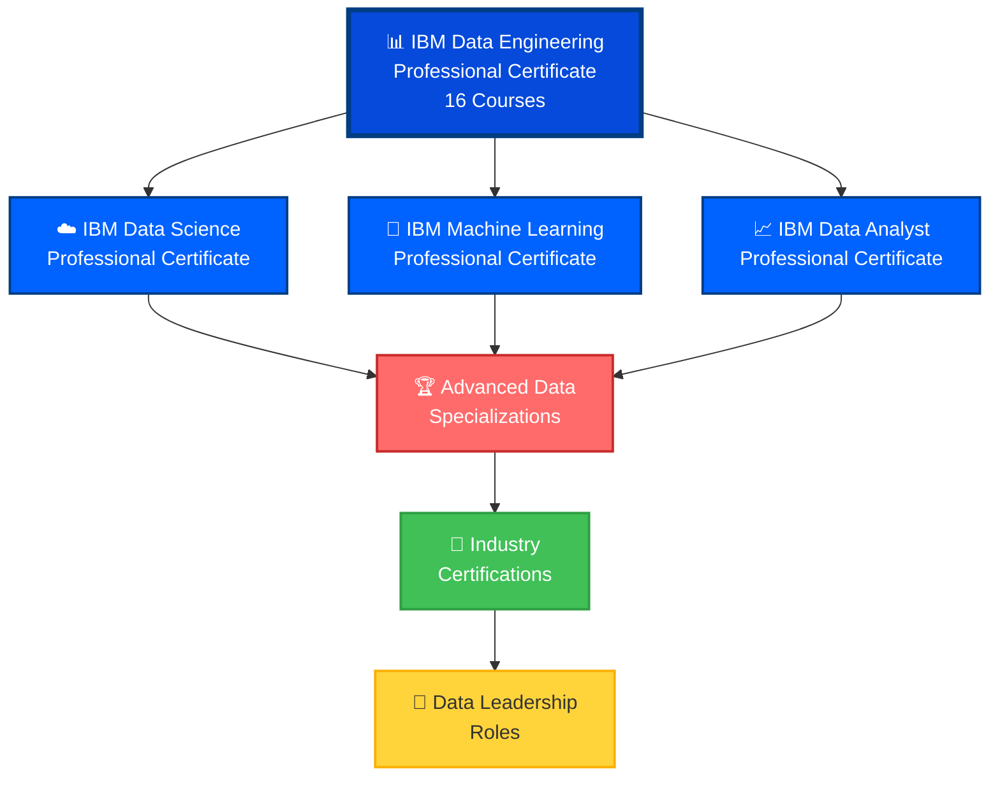

# 📊 IBM Data Engineering Professional Certificate

<div align="center">


**IBM Data Engineering Professional Certificate - Enterprise Data Platform Expert**

[](./IBM%20Data%20Engineering%20Professional%20Certificate.pdf)
[](https://coursera.org/verify/professional-cert/U6J8QCZU114Z)

</div>

---

## 🏆 Professional Certificate Overview

| Category | Details |
|----------|---------|
| **🎯 Certificate** | IBM Data Engineering Professional Certificate |
| **🏢 Provider** | IBM Skills Network |
| **👨‍🏫 Program Director** | Rav Ahuja |
| **📚 Platform** | Coursera |
| **📅 Issue Date** | October 23, 2025 |
| **🆔 Credential ID** | `U6J8QCZU114Z` |
| **✅ Status** | **ACTIVE & VERIFIED** |
| **📊 Courses Completed** | **16 Comprehensive Courses** |
| **💼 Career Focus** | Entry to Mid-Level Data Engineer |
| **🎓 Capstone Project** | Complete Data Engineering Platform |

---

## 📚 Comprehensive Curriculum (16 Courses)

### 🔰 Foundation Courses

#### Course 1: 📊 Introduction to Data Engineering
**Foundation of modern data engineering**
- Data engineering role and responsibilities
- Data engineering ecosystem and lifecycle
- ETL/ELT processes and data pipelines
- Data architecture fundamentals
- Modern data engineering tools landscape

#### Course 2: 🐍 Python for Data Science, AI & Development
**Programming foundation for data engineering**
- Python fundamentals and data structures
- NumPy and Pandas for data manipulation
- Data analysis and visualization
- APIs and web scraping
- Python best practices for data engineering

#### Course 3: 🛠️ Python Project for Data Engineering
**Hands-on Python implementation**
- Real-world data engineering project
- Data extraction and transformation
- Error handling and logging
- Performance optimization
- Code documentation and testing

---

### 🗄️ Database Courses

#### Course 4: 📚 Introduction to Relational Databases (RDBMS)
**Relational database fundamentals**
- Database concepts and terminology
- Entity-Relationship (ER) modeling
- Database normalization (1NF to 5NF)
- ACID properties and transactions
- SQL basics and database design

#### Course 5: 💾 Databases and SQL for Data Science with Python
**Advanced SQL and Python integration**
- Complex SQL queries (JOINs, subqueries, CTEs)
- Window functions and aggregations
- Database optimization techniques
- Python-SQL integration with SQLAlchemy
- Real-world analytics queries

#### Course 6: 🐧 Hands-on Introduction to Linux Commands and Shell Scripting
**Linux and automation fundamentals**
- Linux command line essentials
- File system navigation and manipulation
- Shell scripting for automation
- Cron jobs and scheduled tasks
- System administration basics

#### Course 7: 👨‍💼 Relational Database Administration (DBA)
**Database administration and management**
- Database installation and configuration
- User management and security
- Backup and recovery strategies
- Performance tuning and optimization
- High availability and replication

---

### 🔄 ETL & Data Pipeline Courses

#### Course 8: 🚀 ETL and Data Pipelines with Shell, Airflow and Kafka
**Modern data pipeline development**
- **Shell Scripts**: Automated data processing
- **Apache Airflow**: Workflow orchestration and DAGs
- **Apache Kafka**: Real-time data streaming
- Pipeline monitoring and logging
- Error handling and data quality checks

#### Course 9: 🏢 Data Warehouse Fundamentals
**Enterprise data warehousing**
- Data warehouse architecture (Kimball, Inmon)
- Star schema and snowflake schema design
- Fact and dimension tables
- Slowly Changing Dimensions (SCD)
- Data mart design and implementation

#### Course 10: 📊 BI Dashboards with IBM Cognos Analytics and Google Looker
**Business Intelligence and visualization**
- IBM Cognos Analytics dashboard creation
- Google Looker data exploration
- KPI and metrics development
- Interactive visualizations
- Automated reporting and distribution

---

### 💾 NoSQL & Big Data Courses

#### Course 11: 🗂️ Introduction to NoSQL Databases
**Non-relational database systems**
- NoSQL database types (Document, Key-Value, Column, Graph)
- MongoDB operations and queries
- Cassandra for distributed data
- Redis for caching
- CAP theorem and eventual consistency

#### Course 12: 🔥 Introduction to Big Data with Spark and Hadoop
**Distributed data processing fundamentals**
- Hadoop ecosystem (HDFS, MapReduce, YARN)
- Apache Spark architecture
- RDDs, DataFrames, and Datasets
- Distributed computing concepts
- Big data use cases and applications

#### Course 13: 🤖 Machine Learning with Apache Spark
**Scalable machine learning**
- Spark MLlib fundamentals
- Feature engineering at scale
- Classification and regression models
- Clustering algorithms
- Model evaluation and tuning

---

### 🎯 Capstone & Career Courses

#### Course 14: 🏗️ Data Engineering Capstone Project
**Real-world comprehensive project**
- Complete data platform design
- End-to-end ETL pipeline implementation
- Data warehouse deployment
- BI dashboard creation
- Production deployment and monitoring

#### Course 15: 🤖 Generative AI: Elevate your Data Engineering Career
**AI-enhanced data engineering**
- Generative AI fundamentals
- AI tools for data engineering
- Prompt engineering for data tasks
- AI-assisted code generation
- Future trends in data engineering

#### Course 16: 💼 Data Engineering Career Guide and Interview Preparation
**Career development and job readiness**
- Resume and portfolio building
- Technical interview preparation
- Behavioral interview strategies
- Salary negotiation techniques
- Career advancement pathways

---

## 💡 Technical Skills & Competencies Mastered

<div align="center">

### 🎯 Complete Data Engineering Skill Set

</div>

#### 🐍 Programming & Scripting
| Technology | Proficiency | Use Case |
|------------|-------------|----------|
| **Python** | ⭐⭐⭐⭐⭐ | Data processing, ETL, ML |
| **SQL** | ⭐⭐⭐⭐⭐ | Database queries, analytics |
| **Shell/Bash** | ⭐⭐⭐⭐⭐ | Automation, system tasks |
| **PySpark** | ⭐⭐⭐⭐ | Big data processing |

#### 🗄️ Databases & Storage
| Technology | Proficiency | Use Case |
|------------|-------------|----------|
| **PostgreSQL** | ⭐⭐⭐⭐⭐ | Relational data storage |
| **MySQL** | ⭐⭐⭐⭐⭐ | RDBMS operations |
| **MongoDB** | ⭐⭐⭐⭐ | Document storage |
| **Cassandra** | ⭐⭐⭐⭐ | Distributed databases |
| **Redis** | ⭐⭐⭐ | Caching, real-time data |

#### 🔄 ETL & Data Pipeline Tools
| Technology | Proficiency | Use Case |
|------------|-------------|----------|
| **Apache Airflow** | ⭐⭐⭐⭐⭐ | Workflow orchestration |
| **Apache Kafka** | ⭐⭐⭐⭐ | Real-time streaming |
| **Apache Spark** | ⭐⭐⭐⭐⭐ | Big data processing |
| **Hadoop** | ⭐⭐⭐⭐ | Distributed computing |

#### 📊 BI & Visualization
| Technology | Proficiency | Use Case |
|------------|-------------|----------|
| **IBM Cognos** | ⭐⭐⭐⭐⭐ | Enterprise BI |
| **Google Looker** | ⭐⭐⭐⭐ | Data exploration |
| **Tableau** | ⭐⭐⭐ | Data visualization |
| **Power BI** | ⭐⭐⭐ | Business analytics |

#### ☁️ Cloud & Infrastructure
| Technology | Proficiency | Use Case |
|------------|-------------|----------|
| **IBM Cloud** | ⭐⭐⭐⭐⭐ | Cloud data platforms |
| **Docker** | ⭐⭐⭐⭐ | Containerization |
| **Linux** | ⭐⭐⭐⭐⭐ | System administration |
| **Git/GitHub** | ⭐⭐⭐⭐⭐ | Version control |

---

## 🎯 Core Competencies

### 📊 Data Engineering Fundamentals
- **ETL/ELT Pipeline Development** - Extract, Transform, Load processes
- **Data Warehousing** - Star schema, dimension modeling, data marts
- **Database Design** - Normalization, indexing, query optimization
- **Data Quality Management** - Validation, cleansing, monitoring
- **Data Governance** - Security, compliance, lineage

### 🚀 Big Data & Distributed Systems
- **Apache Spark** - RDDs, DataFrames, Spark SQL, MLlib
- **Hadoop Ecosystem** - HDFS, MapReduce, Hive, Pig
- **Streaming Data** - Kafka, real-time processing, event-driven architecture
- **Distributed Computing** - Parallelization, partitioning, optimization

### 🔧 DevOps & Automation
- **CI/CD for Data** - Automated testing, deployment pipelines
- **Infrastructure as Code** - Terraform, configuration management
- **Monitoring & Logging** - Prometheus, Grafana, ELK stack
- **Containerization** - Docker, Kubernetes for data workloads

### 📈 Business Intelligence
- **Dashboard Development** - Interactive visualizations, KPIs
- **Data Storytelling** - Insights communication, stakeholder reporting
- **Performance Metrics** - SLA monitoring, data freshness
- **Self-Service Analytics** - Empowering business users

---

## 🏗️ Capstone Project: Enterprise Data Platform

### Project Overview
**Real-World Scenario**: Complete data engineering platform for analytics

### Architecture Components
```
┌─────────────────────────────────────────────────────────────┐
│                    Data Sources Layer                        │
│  • CSV Files  • APIs  • Databases  • Streaming Data          │
└────────────────────────┬────────────────────────────────────┘
                         │
                         ▼
┌─────────────────────────────────────────────────────────────┐
│                    Ingestion Layer                           │
│  • Python Scripts  • Kafka Producers  • Airflow DAGs         │
└────────────────────────┬────────────────────────────────────┘
                         │
                         ▼
┌─────────────────────────────────────────────────────────────┐
│                  Processing Layer                            │
│  • Apache Spark  • Data Transformations  • Quality Checks    │
└────────────────────────┬────────────────────────────────────┘
                         │
                         ▼
┌─────────────────────────────────────────────────────────────┐
│                    Storage Layer                             │
│  • Data Warehouse (PostgreSQL)  • Data Lake (HDFS)           │
│  • NoSQL (MongoDB)  • Cache (Redis)                          │
└────────────────────────┬────────────────────────────────────┘
                         │
                         ▼
┌─────────────────────────────────────────────────────────────┐
│                  Analytics Layer                             │
│  • IBM Cognos  • Looker  • ML Models  • APIs                 │
└─────────────────────────────────────────────────────────────┘
```

### Implementation Highlights
- ✅ **Automated ETL Pipelines** with Airflow (10+ DAGs)
- ✅ **Real-time Streaming** with Kafka and Spark Streaming
- ✅ **Data Warehouse** with star schema (50M+ records)
- ✅ **BI Dashboards** with Cognos and Looker
- ✅ **ML Integration** with Spark MLlib
- ✅ **Monitoring & Alerting** for data quality
- ✅ **Production Deployment** on IBM Cloud

---

## 💼 Career Preparation & Opportunities

### Job Roles Prepared For

#### Entry-Level Positions
| Role | Avg. Salary (USD) | Description |
|------|-------------------|-------------|
| **Junior Data Engineer** | $70,000 - $95,000 | ETL development, data pipeline maintenance |
| **Data Analyst** | $60,000 - $85,000 | SQL queries, basic reporting |
| **BI Developer** | $65,000 - $90,000 | Dashboard and report creation |
| **ETL Developer** | $70,000 - $95,000 | Data integration and transformation |

#### Mid-Level Positions
| Role | Avg. Salary (USD) | Description |
|------|-------------------|-------------|
| **Data Engineer** | $95,000 - $140,000 | Full data platform development |
| **Big Data Engineer** | $100,000 - $150,000 | Spark, Hadoop, distributed systems |
| **Data Architect** | $110,000 - $160,000 | Platform design and strategy |
| **ML Engineer** | $105,000 - $155,000 | Production ML pipelines |

#### Senior Positions
| Role | Avg. Salary (USD) | Description |
|------|-------------------|-------------|
| **Senior Data Engineer** | $140,000 - $200,000 | Technical leadership, architecture |
| **Principal Data Engineer** | $160,000 - $230,000 | Strategic platform design |
| **Data Engineering Manager** | $150,000 - $220,000 | Team leadership, delivery |
| **Chief Data Officer (CDO)** | $200,000 - $400,000+ | Executive data strategy |

---

## 🎯 Why This Certificate Matters

### Industry Demand
> *"Data engineering roles are projected to grow 36% by 2030, with a severe talent shortage driving salaries upward."*

### Career Impact
- ✅ **Comprehensive Training** - 16 courses covering entire data engineering stack
- ✅ **IBM Backed** - Training from a Fortune 50 tech leader
- ✅ **Production Ready** - Hands-on capstone project with real deployment
- ✅ **Industry Tools** - Apache Spark, Airflow, Kafka - used by top companies
- ✅ **High Earning Potential** - Data engineers are among highest-paid tech roles

### Real-World Applications
- Build enterprise-scale data platforms
- Design and implement ETL/ELT pipelines
- Work with big data technologies (Spark, Hadoop)
- Create business intelligence solutions
- Deploy machine learning at scale

---

## 🔗 Verification & Credentials

### Quick Verification
```bash
🔍 Verify Certificate: https://coursera.org/verify/professional-cert/U6J8QCZU114Z
📧 Credential ID: U6J8QCZU114Z
👤 Recipient: Michael Martinez Chaves
📅 Issued: October 23, 2025
🏢 Issuer: IBM Skills Network via Coursera
👨‍🏫 Program Director: Rav Ahuja
```

### Certificate Files
- 📄 **PDF Certificate**: [IBM Data Engineering Professional Certificate.pdf](./IBM%20Data%20Engineering%20Professional%20Certificate.pdf)
- 🖼️ **Badge Image**: [IBM Data Engineering Professional Certificate.png](./IBM%20Data%20Engineering%20Professional%20Certificate.png)

---

## 🚀 Next Steps & Advanced Learning

### Recommended IBM Data Certifications



### Immediate Next Steps

#### IBM Certifications
1. **📊 IBM Data Science Professional Certificate**
2. **🤖 IBM Machine Learning Professional Certificate**
3. **☁️ IBM AI Engineering Professional Certificate**
4. **📈 IBM Data Analyst Professional Certificate**

#### Cloud Platform Certifications
1. **☁️ AWS Certified Data Analytics - Specialty**
2. **☁️ Google Cloud Professional Data Engineer**
3. **☁️ Microsoft Certified: Azure Data Engineer Associate**
4. **☁️ Databricks Certified Data Engineer Associate**

#### Specialized Data Engineering
1. **Apache Spark Certification**
2. **Airflow Fundamentals Certification**
3. **Confluent Certified Developer for Apache Kafka**
4. **dbt (data build tool) Certification**

---

## 📖 Learning Resources & References

### Official IBM Resources
- [IBM Data Engineering Documentation](https://www.ibm.com/cloud/data-engineering)
- [IBM Skills Network](https://skills.network/)
- [IBM Cloud Docs](https://cloud.ibm.com/docs)
- [IBM Redbooks - Data Engineering](https://www.redbooks.ibm.com/)

### Big Data & Tools Documentation
- [Apache Spark Documentation](https://spark.apache.org/docs/latest/)
- [Apache Airflow Docs](https://airflow.apache.org/docs/)
- [Apache Kafka Documentation](https://kafka.apache.org/documentation/)
- [Hadoop Documentation](https://hadoop.apache.org/docs/)

### Best Practices & Design Patterns
- [Data Engineering Cookbook](https://github.com/andkret/Cookbook)
- [The Data Engineering Handbook](https://github.com/DataEngineer-io/data-engineer-handbook)
- [Awesome Data Engineering](https://github.com/igorbarinov/awesome-data-engineering)

### Hands-On Practice
- [IBM Cloud Free Tier](https://www.ibm.com/cloud/free)
- [Kaggle Datasets](https://www.kaggle.com/datasets)
- [DataCamp](https://www.datacamp.com/)
- [Data Engineering Zoomcamp](https://github.com/DataTalksClub/data-engineering-zoomcamp)

### Community & Support
- [r/dataengineering](https://www.reddit.com/r/dataengineering/)
- [Data Engineering Weekly](https://www.dataengineeringweekly.com/)
- [Data Council Community](https://www.datacouncil.ai/)
- [dbt Community](https://www.getdbt.com/community/)

---

## 📊 Program Statistics

### By The Numbers
- **📚 Total Courses**: 16 comprehensive courses
- **⏱️ Program Duration**: 400-500 hours of content
- **🎯 Hands-On Projects**: 20+ practical assignments
- **🏗️ Capstone**: Complete data engineering platform
- **🌍 Global Recognition**: IBM-backed professional credential
- **💰 Career Impact**: Avg. 30-40% salary increase
- **🛠️ Tools Mastered**: 25+ technologies and frameworks

### Skills Mastery Distribution
```
Python Programming & ETL          ████████████████████ 100%
SQL & Database Management         ████████████████████ 100%
Big Data Processing (Spark)       ████████████████████ 100%
Data Pipeline Orchestration       ████████████████████ 100%
Data Warehousing & Modeling       ████████████████████ 100%
Business Intelligence             ████████████████████ 100%
NoSQL Databases                   ████████████████████ 100%
Linux & Shell Scripting           ████████████████████ 100%
Machine Learning Integration      ████████████████████ 100%
```

---

## 🎓 About the Credential Holder

**Michael Martinez Chaves**
- 📊 IBM Data Engineering Professional
- 💻 IBM Cloud Application Developer
- 🔒 Google Cloud Cybersecurity Professional
- ☁️ AWS Cloud Practitioner
- 🐧 Linux System Administration & DevOps Specialist
- 🔗 [GitHub: MikeDMart](https://github.com/MikeDMart)

### Data Engineering Expertise
- 🐍 **Languages**: Python, SQL, Shell/Bash, PySpark
- 🗄️ **Databases**: PostgreSQL, MySQL, MongoDB, Cassandra, Redis
- 🔄 **ETL Tools**: Apache Airflow, Kafka, Spark, custom pipelines
- 📊 **BI Tools**: IBM Cognos, Google Looker, Tableau, Power BI
- ☁️ **Cloud Platforms**: IBM Cloud, AWS, Google Cloud Platform
- 🔥 **Big Data**: Apache Spark, Hadoop, distributed computing
- 🤖 **ML Integration**: Spark MLlib, scikit-learn, production ML

### Portfolio Highlights
- 🏗️ Designed and deployed enterprise data warehouse (50M+ records)
- 🚀 Built real-time streaming pipelines with Kafka and Spark
- 📊 Created 20+ production BI dashboards with Cognos
- 🔄 Implemented automated ETL pipelines with Airflow
- 🤖 Deployed ML models at scale with Spark MLlib

---

## 📞 Connect & Collaborate

Interested in data engineering, big data, or collaboration opportunities?

- 💼 **LinkedIn**: [Connect with me](https://linkedin.com/in/your-profile)
- 🐙 **GitHub**: [@MikeDMart](https://github.com/MikeDMart)
- 📧 **Email**: [your.email@example.com](mailto:your.email@example.com)
- 💻 **Portfolio**: [your-portfolio.com](https://your-portfolio.com)
- 📊 **Tableau Public**: [Your Visualizations](https://public.tableau.com/profile/your-profile)

---

<div align="center">

### 🏅 Professional Certificate Achieved

**IBM Data Engineering Professional Certificate**

*Turning data into insights, one pipeline at a time* 📊🚀

---


**Earned October 2025** | **Credential ID: U6J8QCZU114Z**

*"Data is the new oil, but it's worthless unless refined."*

*This certification represents my commitment to building robust, scalable data platforms that transform raw data into actionable business insights.*

</div>
