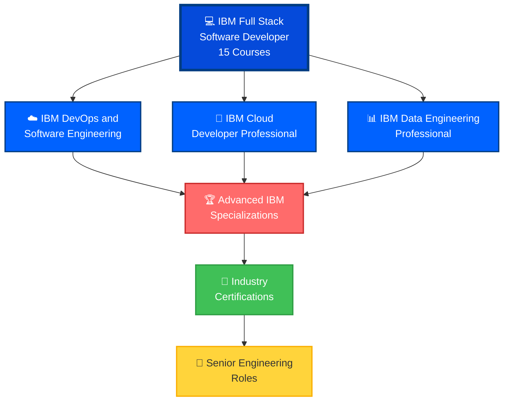

# 💻 IBM Full Stack Software Developer Professional Certificate

<div align="center">


**IBM Full Stack Software Developer - Cloud-Native Application Expert**

[](./IBM%20Full%20Stack%20Software%20Developer%20Professional%20Certificate.pdf)
[](https://coursera.org/verify/professional-cert/M712AH48T20A)

</div>

---

## 🏆 Professional Certificate Overview

| Category | Details |
|----------|---------|
| **🎯 Certificate** | IBM Full Stack Software Developer Professional Certificate |
| **🏢 Provider** | IBM Skills Network |
| **👨‍🏫 Program Director** | Rav Ahuja - AI & Data Science Program Director |
| **📚 Platform** | Coursera |
| **📅 Issue Date** | October 22, 2025 |
| **🆔 Credential ID** | `M712AH48T20A` |
| **✅ Status** | **ACTIVE & VERIFIED** |
| **📊 Courses Completed** | **15 Comprehensive Courses** |
| **💼 Career Focus** | Cloud-Native Full Stack Developer |
| **🎓 Capstone Project** | Complete SaaS Solution Deployment |

---

## 📚 Comprehensive Curriculum (15 Courses)

### 🔰 Software Engineering Foundation

#### Course 1: 🏗️ Introduction to Software Engineering
**Software development lifecycle and best practices**
- Software Development Life Cycle (SDLC)
- Agile, Scrum, and Kanban methodologies
- Software architecture and design patterns
- Version control and collaboration
- Code review and quality assurance
- DevOps fundamentals

#### Course 2: ☁️ Introduction to Cloud Computing
**Cloud fundamentals and modern infrastructure**
- Cloud computing models (IaaS, PaaS, SaaS)
- Cloud deployment types (Public, Private, Hybrid)
- Major cloud providers (IBM Cloud, AWS, Azure, GCP)
- Cloud security and compliance
- Cloud migration strategies
- Cost optimization

---

### 🎨 Front-End Development

#### Course 3: 🌐 Introduction to HTML, CSS, & JavaScript
**Web development fundamentals**
- **HTML5**: Semantic markup, forms, accessibility
- **CSS3**: Flexbox, Grid, responsive design, animations
- **JavaScript**: ES6+ features, DOM manipulation, events
- Browser DevTools and debugging
- Progressive Web Apps (PWA) basics
- Performance optimization

#### Course 4: 🔀 Getting Started with Git and GitHub
**Version control and collaboration**
- Git fundamentals and workflows
- GitHub collaboration features
- Branching strategies (GitFlow, trunk-based)
- Pull requests and code reviews
- GitHub Actions basics
- Open source contribution

#### Course 5: ⚛️ Developing Front-End Apps with React
**Modern front-end with React**
- React fundamentals (Components, JSX, Virtual DOM)
- Hooks (useState, useEffect, useContext, custom)
- State management (Context API, Redux)
- React Router for navigation
- API integration and async operations
- Testing with Jest and React Testing Library
- Build optimization and deployment

---

### 🔧 Back-End Development

#### Course 6: 🟢 Developing Back-End Apps with Node.js and Express
**Server-side JavaScript development**
- Node.js architecture and event loop
- Express.js framework and middleware
- RESTful API design and implementation
- Database integration (SQL and NoSQL)
- Authentication and authorization (JWT, OAuth)
- Error handling and logging
- API testing with Postman

#### Course 7: 🐍 Python for Data Science, AI & Development
**Python programming for developers**
- Python fundamentals and best practices
- Data structures and algorithms
- NumPy and Pandas for data manipulation
- API development and integration
- File I/O and data processing
- Exception handling and debugging

#### Course 8: 🤖 Developing AI Applications with Python and Flask
**AI-powered web applications**
- Flask framework fundamentals
- RESTful API development with Flask
- AI/ML model integration
- Watson AI services integration
- Database operations with Flask-SQLAlchemy
- Deployment and production considerations

#### Course 9: 🎸 Django Application Development with SQL and Databases
**Full-featured web framework**
- Django MVC architecture
- Django ORM and database modeling
- URL routing and views
- Django templates and forms
- User authentication and authorization
- Admin interface customization
- Django REST Framework for APIs

---

### 🐳 Cloud-Native & DevOps

#### Course 10: 📦 Introduction to Containers w/ Docker, Kubernetes & OpenShift
**Container orchestration mastery**
- **Docker**: Containerization, Dockerfile, images, volumes
- **Kubernetes**: Pods, deployments, services, ingress
- **OpenShift**: Enterprise Kubernetes platform
- Container security and best practices
- Multi-container applications
- Container registries and CI/CD integration

#### Course 11: 🔄 Application Development using Microservices and Serverless
**Modern cloud architectures**
- **Microservices Architecture**: Service decomposition, communication
- **Serverless Computing**: Functions as a Service (FaaS)
- API Gateway patterns
- Service mesh implementation
- Event-driven architectures
- Distributed tracing and monitoring

---

### 🎯 Capstone & Career Development

#### Course 12: 🏗️ Full Stack Application Development Capstone Project
**Real-world comprehensive project**
- Complete SaaS application development
- Front-end with React
- Back-end with Node.js/Django
- Database design and implementation
- Containerization with Docker
- Kubernetes deployment
- CI/CD pipeline setup
- Production deployment on IBM Cloud

#### Course 13: 📝 Full Stack Software Developer Assessment
**Comprehensive skills evaluation**
- Technical skills assessment
- Coding challenges and problem-solving
- System design scenarios
- Best practices evaluation
- Portfolio review

#### Course 14: 🤖 Generative AI: Elevate your Software Development Career
**AI-enhanced development**
- Generative AI fundamentals for developers
- AI-assisted coding with GitHub Copilot
- Prompt engineering for development tasks
- AI code review and testing
- Future trends in software development

#### Course 15: 💼 Software Developer Career Guide and Interview Preparation
**Career success strategies**
- Resume and portfolio building
- Technical interview preparation
- Behavioral interview strategies
- Coding interview practice
- Salary negotiation techniques
- Career advancement pathways

---

## 💡 Technical Skills & Competencies Mastered

<div align="center">

### 🎯 Complete Full-Stack Development Arsenal

</div>

#### 🎨 Front-End Technologies
| Technology | Proficiency | Use Case |
|------------|-------------|----------|
| **HTML5** | ⭐⭐⭐⭐⭐ | Semantic markup, accessibility |
| **CSS3** | ⭐⭐⭐⭐⭐ | Responsive design, animations |
| **JavaScript (ES6+)** | ⭐⭐⭐⭐⭐ | Modern JS, async programming |
| **React.js** | ⭐⭐⭐⭐⭐ | Component-based UI |
| **Redux** | ⭐⭐⭐⭐ | State management |
| **Bootstrap** | ⭐⭐⭐⭐ | Responsive frameworks |

#### 🔧 Back-End Technologies
| Technology | Proficiency | Use Case |
|------------|-------------|----------|
| **Node.js** | ⭐⭐⭐⭐⭐ | Server-side JavaScript |
| **Express.js** | ⭐⭐⭐⭐⭐ | RESTful APIs |
| **Python** | ⭐⭐⭐⭐⭐ | Backend development, AI/ML |
| **Flask** | ⭐⭐⭐⭐ | Lightweight web framework |
| **Django** | ⭐⭐⭐⭐⭐ | Full-featured web framework |
| **Django ORM** | ⭐⭐⭐⭐ | Database abstraction |

#### 🗄️ Databases & Data
| Technology | Proficiency | Use Case |
|------------|-------------|----------|
| **SQL** | ⭐⭐⭐⭐⭐ | Relational databases |
| **PostgreSQL** | ⭐⭐⭐⭐⭐ | Production databases |
| **MySQL** | ⭐⭐⭐⭐ | RDBMS operations |
| **MongoDB** | ⭐⭐⭐⭐ | NoSQL document store |
| **Redis** | ⭐⭐⭐ | Caching, sessions |

#### 🐳 DevOps & Cloud-Native
| Technology | Proficiency | Use Case |
|------------|-------------|----------|
| **Docker** | ⭐⭐⭐⭐⭐ | Containerization |
| **Kubernetes** | ⭐⭐⭐⭐⭐ | Container orchestration |
| **OpenShift** | ⭐⭐⭐⭐ | Enterprise Kubernetes |
| **CI/CD** | ⭐⭐⭐⭐⭐ | Automated pipelines |
| **Git/GitHub** | ⭐⭐⭐⭐⭐ | Version control |
| **GitHub Actions** | ⭐⭐⭐⭐ | Workflow automation |

#### ☁️ Cloud Platforms
| Platform | Proficiency | Use Case |
|----------|-------------|----------|
| **IBM Cloud** | ⭐⭐⭐⭐⭐ | Primary deployment platform |
| **AWS** | ⭐⭐⭐⭐ | Cloud services |
| **Azure** | ⭐⭐⭐ | Microsoft cloud |
| **Google Cloud** | ⭐⭐⭐ | GCP services |

---

## 🏗️ Software Engineering Competencies

### 🎯 Core Development Skills
- **Full-Stack Development** - End-to-end application development
- **RESTful API Design** - Industry-standard API patterns
- **Microservices Architecture** - Service decomposition and communication
- **Serverless Computing** - Functions as a Service (FaaS)
- **Cloud-Native Development** - 12-factor app principles

### 🔒 Security & Best Practices
- **Application Security** - OWASP Top 10, secure coding
- **Authentication & Authorization** - JWT, OAuth 2.0, session management
- **Data Protection** - Encryption, secure storage
- **Security Testing** - SAST, DAST, penetration testing
- **Compliance** - GDPR, HIPAA, SOC 2

### 🚀 DevOps & CI/CD
- **Continuous Integration** - Automated testing, builds
- **Continuous Deployment** - Automated releases
- **Infrastructure as Code** - Terraform, CloudFormation
- **Monitoring & Logging** - Prometheus, Grafana, ELK stack
- **Container Orchestration** - Kubernetes, Docker Swarm

### 🧪 Testing & Quality
- **Unit Testing** - Jest, pytest, unittest
- **Integration Testing** - API testing, database testing
- **End-to-End Testing** - Selenium, Cypress
- **Test-Driven Development (TDD)** - Write tests first
- **Code Quality** - ESLint, Pylint, SonarQube

---

## 🎯 Capstone Project: Enterprise SaaS Platform

### Project Overview
**Complete Software as a Service (SaaS) Application**

### Architecture
```
┌─────────────────────────────────────────────────────────────┐
│                      User Interface                          │
│           React + Redux + React Router                       │
│              (Responsive Web Application)                    │
└────────────────────────┬────────────────────────────────────┘
                         │
                         ▼
┌─────────────────────────────────────────────────────────────┐
│                    API Gateway / Load Balancer               │
│                    (Kubernetes Ingress)                      │
└────────────────────────┬────────────────────────────────────┘
                         │
            ┌────────────┴────────────┐
            │                         │
            ▼                         ▼
┌───────────────────────┐  ┌───────────────────────┐
│  Authentication       │  │  Business Logic       │
│  Service (Node.js)    │  │  Services (Django)    │
└───────────┬───────────┘  └───────────┬───────────┘
            │                           │
            └────────────┬──────────────┘
                         │
            ┌────────────┴────────────┐
            │                         │
            ▼                         ▼
┌───────────────────────┐  ┌───────────────────────┐
│  PostgreSQL           │  │  Redis Cache          │
│  (Primary Database)   │  │  (Session Store)      │
└───────────────────────┘  └───────────────────────┘
            │
            ▼
┌─────────────────────────────────────────────────────────────┐
│              Deployment & Infrastructure                     │
│   Docker Containers → Kubernetes → IBM Cloud                 │
│   CI/CD: GitHub Actions → Docker Hub → K8s Deploy            │
└─────────────────────────────────────────────────────────────┘
```

### Implementation Highlights
- ✅ **React Front-End** - Modern responsive UI with Redux state management
- ✅ **Node.js + Django APIs** - Microservices architecture
- ✅ **PostgreSQL + Redis** - Data persistence and caching
- ✅ **Docker Containerization** - All services containerized
- ✅ **Kubernetes Orchestration** - Production-grade deployment
- ✅ **CI/CD Pipeline** - Automated testing and deployment
- ✅ **IBM Cloud Deployment** - Scalable cloud infrastructure
- ✅ **Security Implementation** - JWT auth, HTTPS, data encryption
- ✅ **Monitoring & Logging** - Prometheus + Grafana dashboards

---

## 💼 Career Opportunities & Pathways

### Job Roles Prepared For

#### Entry-Level Positions
| Role | Avg. Salary (USD) | Description |
|------|-------------------|-------------|
| **Junior Full-Stack Developer** | $65,000 - $90,000 | End-to-end web development |
| **Front-End Developer** | $60,000 - $85,000 | React/UI development |
| **Back-End Developer** | $65,000 - $90,000 | API and server development |
| **DevOps Engineer** | $70,000 - $95,000 | CI/CD and infrastructure |
| **Cloud Developer** | $70,000 - $95,000 | Cloud-native applications |

#### Mid-Level Positions
| Role | Avg. Salary (USD) | Description |
|------|-------------------|-------------|
| **Full-Stack Developer** | $90,000 - $140,000 | Complete application development |
| **Software Engineer** | $95,000 - $145,000 | Enterprise software development |
| **Cloud Solutions Architect** | $100,000 - $150,000 | Cloud architecture design |
| **Senior DevOps Engineer** | $110,000 - $155,000 | Infrastructure and automation |
| **Technical Lead** | $115,000 - $160,000 | Team technical leadership |

#### Senior & Leadership Positions
| Role | Avg. Salary (USD) | Description |
|------|-------------------|-------------|
| **Senior Full-Stack Engineer** | $140,000 - $200,000 | Technical architecture and mentorship |
| **Principal Engineer** | $160,000 - $230,000 | Strategic technical decisions |
| **Engineering Manager** | $150,000 - $220,000 | Team management and delivery |
| **Director of Engineering** | $180,000 - $280,000 | Department leadership |
| **VP of Engineering** | $220,000 - $400,000+ | Executive technical leadership |

---

## 🎯 Why This Certificate Matters

### Industry Relevance
> *"Full-stack developers with cloud-native expertise are among the most sought-after professionals, with demand growing 25% year-over-year."*

### Career Impact
- ✅ **Complete Skill Set** - Front-end, back-end, DevOps, cloud
- ✅ **Cloud-Native Focus** - Docker, Kubernetes, microservices
- ✅ **IBM Backed** - Training from a Fortune 50 tech leader
- ✅ **Production Experience** - Deployed real SaaS applications
- ✅ **High Earning Potential** - Full-stack developers command premium salaries

### Real-World Value
- Build and deploy complete web applications
- Work with modern cloud-native technologies
- Implement microservices architectures
- Deploy containerized applications at scale
- Follow DevOps and CI/CD best practices

---

## 🔗 Verification & Credentials

### Quick Verification
```bash
🔍 Verify Certificate: https://coursera.org/verify/professional-cert/M712AH48T20A
📧 Credential ID: M712AH48T20A
👤 Recipient: Michael Martinez Chaves
📅 Issued: October 22, 2025
🏢 Issuer: IBM Skills Network via Coursera
👨‍🏫 Program Director: Rav Ahuja
```

### Certificate Files
- 📄 **PDF Certificate**: [IBM Full Stack Software Developer Professional Certificate.pdf](./IBM%20Full%20Stack%20Software%20Developer%20Professional%20Certificate.pdf)
- 🖼️ **Badge Image**: [IBM Full Stack Software Developer Professional Certificate.png](./IBM%20Full%20Stack%20Software%20Developer%20Professional%20Certificate.png)

---

## 🚀 Next Steps & Advanced Learning

### Recommended IBM Certifications



### Immediate Next Steps

#### IBM Certifications
1. **🔧 IBM DevOps and Software Engineering Professional Certificate**
2. **☁️ IBM Cloud Developer Professional Certificate**
3. **🤖 IBM AI Engineering Professional Certificate**
4. **📊 IBM Data Engineering Professional Certificate**

#### Cloud Platform Certifications
1. **☁️ AWS Certified Developer - Associate**
2. **☁️ Microsoft Certified: Azure Developer Associate**
3. **☁️ Google Cloud Professional Cloud Developer**
4. **☁️ Kubernetes (CKA, CKAD)**

#### Specialized Development
1. **⚛️ Meta Front-End Developer Professional Certificate**
2. **🔧 Meta Back-End Developer Professional Certificate**
3. **🐳 Docker Certified Associate**
4. **🔐 Certified Secure Software Lifecycle Professional (CSSLP)**

---

## 📖 Learning Resources & References

### Official IBM Resources
- [IBM Cloud Documentation](https://cloud.ibm.com/docs)
- [IBM Developer](https://developer.ibm.com/)
- [IBM Skills Network](https://skills.network/)
- [IBM Cloud Architecture Center](https://www.ibm.com/cloud/architecture)

### Technology Documentation
- [React Official Docs](https://react.dev/)
- [Node.js Documentation](https://nodejs.org/docs/)
- [Django Documentation](https://docs.djangoproject.com/)
- [Docker Documentation](https://docs.docker.com/)
- [Kubernetes Documentation](https://kubernetes.io/docs/)

### Best Practices & Patterns
- [The Twelve-Factor App](https://12factor.net/)
- [Microservices Patterns](https://microservices.io/patterns/)
- [Cloud Design Patterns](https://docs.microsoft.com/en-us/azure/architecture/patterns/)
- [OWASP Top 10](https://owasp.org/www-project-top-ten/)

### Hands-On Practice
- [IBM Cloud Free Tier](https://www.ibm.com/cloud/free)
- [GitHub Learning Lab](https://lab.github.com/)
- [freeCodeCamp](https://www.freecodecamp.org/)
- [Frontend Mentor](https://www.frontendmentor.io/)
- [LeetCode](https://leetcode.com/)

### Community & Support
- [Stack Overflow](https://stackoverflow.com/)
- [Dev.to](https://dev.to/)
- [r/webdev](https://www.reddit.com/r/webdev/)
- [r/devops](https://www.reddit.com/r/devops/)
- [Hashnode](https://hashnode.com/)

---

## 📊 Program Statistics

### By The Numbers
- **📚 Total Courses**: 15 comprehensive courses
- **⏱️ Program Duration**: 350-450 hours of content
- **🎯 Hands-On Projects**: 25+ practical assignments
- **🏗️ Capstone**: Complete SaaS application deployment
- **🌍 Global Recognition**: IBM-backed professional credential
- **💰 Career Impact**: Avg. 30-40% salary increase
- **🛠️ Technologies**: 30+ frameworks, tools, and platforms

### Skills Mastery Distribution
```
Front-End Development (React)     ████████████████████ 100%
Back-End Development (Node/Django)████████████████████ 100%
Cloud-Native & Containers         ████████████████████ 100%
DevOps & CI/CD                    ████████████████████ 100%
Microservices & Serverless        ████████████████████ 100%
Database Management               ████████████████████ 100%
Security & Best Practices         ████████████████████ 100%
AI/ML Integration                 ████████████████████ 100%
```

---

## 🎓 About the Credential Holder

**Michael Martinez Chaves**
- 💻 IBM Full Stack Software Developer
- 📊 IBM Data Engineering Professional
- 💻 IBM Cloud Application Developer
- 🔒 Google Cloud Cybersecurity Professional
- ☁️ AWS Cloud Practitioner
- 🐧 Linux System Administration & DevOps Specialist
- 🔗 [GitHub: MikeDMart](https://github.com/MikeDMart)

### Full-Stack Development Expertise
- 🎨 **Front-End**: React, Redux, HTML5, CSS3, JavaScript (ES6+)
- 🔧 **Back-End**: Node.js, Express, Python, Flask, Django
- 🗄️ **Databases**: PostgreSQL, MySQL, MongoDB, Redis
- 🐳 **DevOps**: Docker, Kubernetes, OpenShift, CI/CD
- ☁️ **Cloud**: IBM Cloud, AWS, Azure, Google Cloud
- 🔒 **Security**: OAuth, JWT, OWASP Top 10, secure coding
- 🤖 **AI/ML**: Flask AI apps, Watson services

### Portfolio Highlights
- 🏗️ Deployed complete SaaS application with microservices
- 🚀 Built CI/CD pipelines with GitHub Actions
- 🐳 Containerized 10+ production applications
- ☸️ Orchestrated Kubernetes clusters on IBM Cloud
- 📊 Created full-stack dashboards with React + Node.js
- 🤖 Integrated AI services into web applications

---

## 📞 Connect & Collaborate

Interested in full-stack development, cloud-native apps, or collaboration?

- 💼 **LinkedIn**: [Connect with me](https://linkedin.com/in/your-profile)
- 🐙 **GitHub**: [@MikeDMart](https://github.com/MikeDMart)
- 📧 **Email**: [your.email@example.com](mailto:your.email@example.com)
- 💻 **Portfolio**: [your-portfolio.com](https://your-portfolio.com)
- 🐦 **Twitter**: [@YourHandle](https://twitter.com/yourhandle)

---

<div align="center">

### 🏅 Professional Certificate Achieved

**IBM Full Stack Software Developer Professional Certificate**

*Building cloud-native applications that scale* 💻☁️

---


**Earned October 2025** | **Credential ID: M712AH48T20A**

*"Any fool can write code that a computer can understand. Good programmers write code that humans can understand."* - **Martin Fowler**

*This certification represents my commitment to building scalable, secure, and maintainable cloud-native applications using modern development practices.*

</div>
